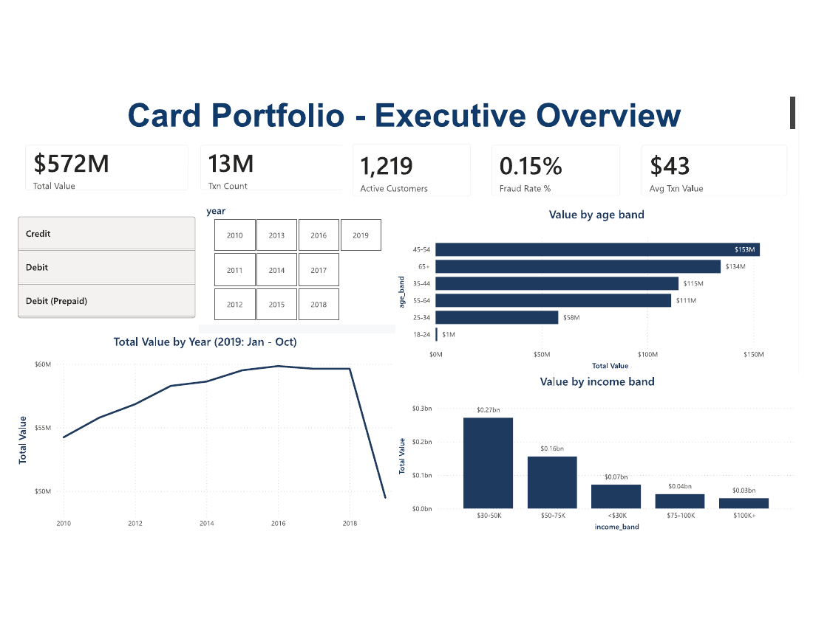
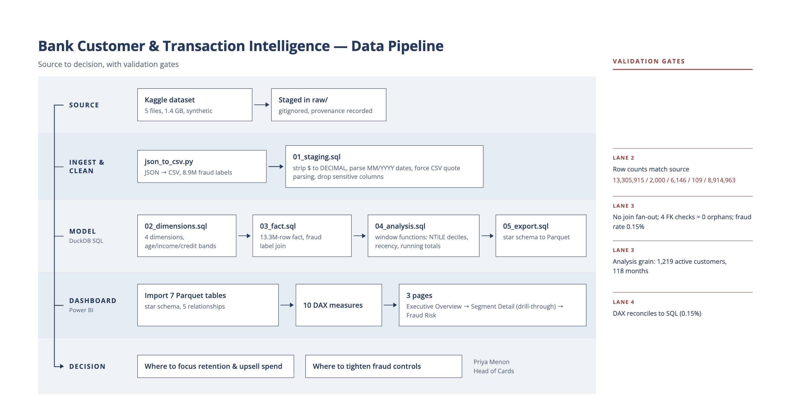
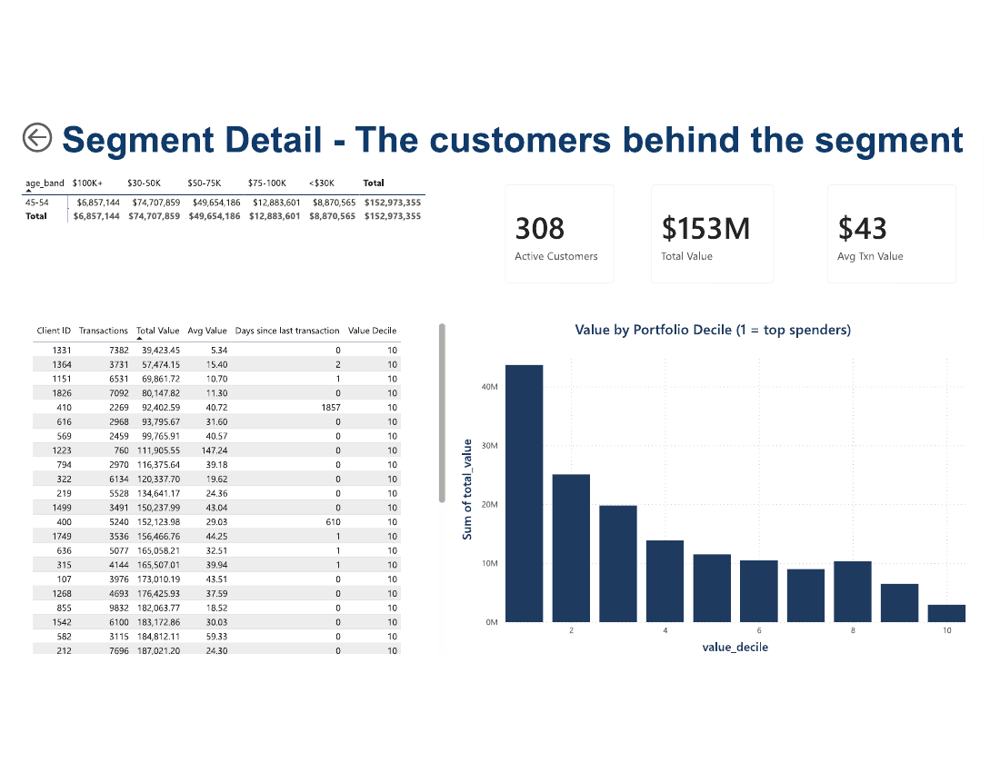
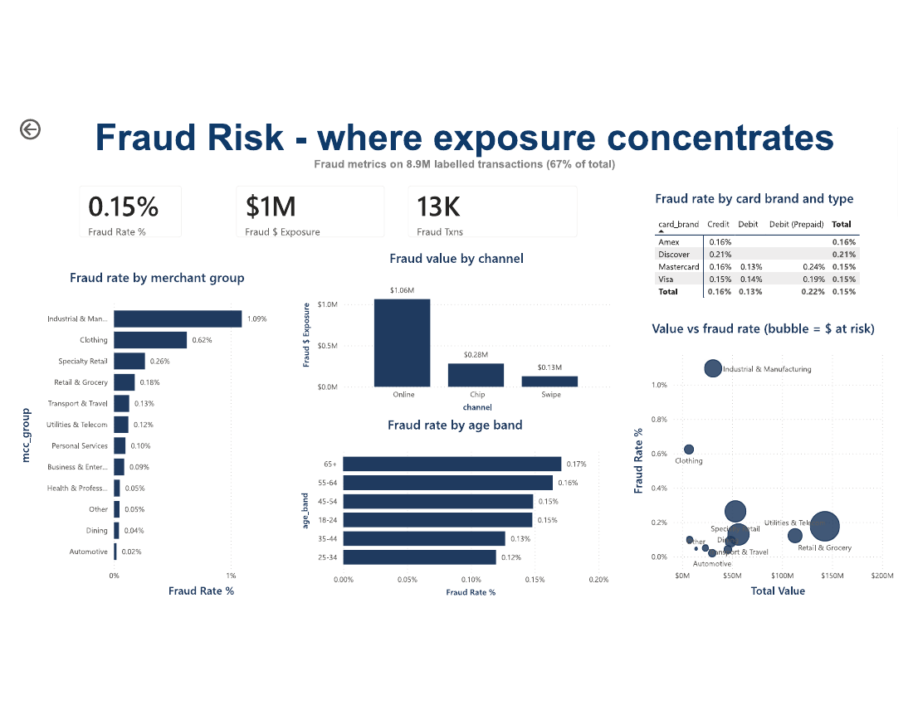

# Bank Customer & Transaction Intelligence

**Which customer segments drive transaction value, and where is fraud exposure
actually concentrated?**

Analysing 13.3M transactions revealed a concentration problem: 72% of fraud
exposure runs through a single channel.

An end-to-end BI build structured the way a real BI request runs — a business
problem, translated into a data model, queried and reported, then read back as
discrepancies worth acting on.

`Problem → Business framing → Technical build → Discrepancies → Recommended actions`



---

## What this delivers

Three decisions the bank could not make from raw transaction files, and what
each is worth.

| Decision it enables | The finding behind it | Why it matters |
|---|---|---|
| **Aim growth spend at the segments that actually spend** | The $30–50K income band drives **$270M of $572M (47%)**; the $100K+ tier drives **$30M (5%)** | Marketing aimed at the premium tier would chase 5% of the book. This redirects spend toward 47% of it |
| **Target fraud controls at one channel instead of the whole portfolio** | **72% of fraud exposure ($1.06M of $1.47M)** arrives online, against $0.28M chip and $0.13M swipe | Online-only step-up authentication addresses roughly three-quarters of exposure while leaving card-present customers frictionless |
| **Protect the customers who carry the book** | The top decile of cardholders holds **24% of all transaction value** | Retention effort can be aimed at ~120 named customers rather than spread across 1,219 |

**Efficiency the build itself provides:** a question that previously required a
data request now takes a click. The star schema and drill-through let the Head of
Cards move from portfolio KPI to the individual customers inside a segment
without an analyst in the loop, and the model rebuilds from raw files with five
scripted commands.

**What it deliberately does not claim:** no loss-reduction figure is quoted here.
Sizing avoided losses requires the friction cost of the control and the false-positive
rate, neither of which is in this dataset. Estimating it would be a guess dressed
as a result.

---

## 1. The problem

Priya Menon (fictional stakeholder) is Head of Cards at a mid-size retail bank.
Card growth targets are rising, fraud losses are rising with them, and complaints
about payment friction are increasing. Blanket controls would cut fraud but hit
good customers; doing nothing lets losses run.

**The decision she needs to make:** where to concentrate retention and upsell
spend, and where to tighten fraud controls without adding friction for valuable
customers.

**Three questions that decision breaks into:**

1. Which customer segments — by age, income and credit band — generate the most transaction value?
2. Where is labelled fraud concentrated — by merchant category, card type and channel?
3. Do high-value segments overlap with high fraud exposure?

Full brief with agreed KPIs and an explicit out-of-scope list:
[`docs/requirements_brief.md`](docs/requirements_brief.md)

---

## 2. Business framing — mapping the question to the data

Before writing SQL, each business question had to map onto fields that actually
exist, and the mapping is where the domain knowledge lives.

| Business concept | Data mapping | Domain reasoning |
|---|---|---|
| Customer value | `SUM(amount)` per client, plus `NTILE(10)` decile rank | Cards are a volume business; concentration matters more than averages, so customers are ranked, not just totalled |
| Customer segment | Age, income and credit bands derived in SQL | Banded once in the model, not in DAX, so every downstream report shares one definition |
| Creditworthiness | FICO bands (<580, 580–669, 670–739, 740–799, 800+) | Industry-standard cut-offs, not invented ranges — defensible to a risk team |
| Merchant category | 109 MCC codes grouped to 12 | ISO 18245 ranges, except this dataset's 3000s hold industrial codes rather than the standard airline block — verified by profiling, not assumed |
| Channel | `use_chip` → Chip / Swipe / Online | Card-present vs card-not-present is the core fraud distinction in payments |
| Fraud exposure | `SUM(amount)` where labelled fraud | Dollars at risk, not incident counts — a count treats a $12 and a $1,200 fraud alike |
| Account tenure | Months from account open to **2019-10-31** | The data is frozen in 2019; ageing it against today's date would silently inflate every tenure |

**What was deliberately left out, and why:** `card_number` and `cvv` (sensitive-style
fields, even in synthetic data); `card_on_dark_web` (constant "No" across all 6,146
rows — zero signal); `zip` (typed as a float, leading zeros already lost); geography
below state level, per the scope agreement.

---

## 3. Technical build — query, model, report

**Data:** Kaggle "Financial Transactions Dataset: Analytics" — 13,305,915
transactions, 2,000 customers, 6,146 cards, 109 merchant categories, 8.9M fraud
labels. Synthetic, no real PII. Raw files gitignored; see
[`docs/data_provenance.md`](docs/data_provenance.md).

**Why DuckDB:** reads the 1.2 GB CSV directly with no import step, runs window
functions over 13M rows in seconds, and exports Parquet that Power BI reads
natively. SQLite is a row-store built for transactions — the wrong engine for an
analytical workload.



| Script | What it does |
|---|---|
| [`sql/01_staging.sql`](sql/01_staging.sql) | Typed staging — strips `$` to DECIMAL, parses MM/YYYY dates, forces CSV quote handling (the `errors` field contains quoted, comma-joined values that defeat sampled auto-detection) |
| [`sql/02_dimensions.sql`](sql/02_dimensions.sql) | Four dimensions with the banding and MCC grouping logic above |
| [`sql/03_fact.sql`](sql/03_fact.sql) | 13.3M-row fact; fraud labels joined as three-state — fraud / legit / unlabelled |
| [`sql/04_analysis.sql`](sql/04_analysis.sql) | Window functions: `NTILE(10)` deciles, recency, running totals, 3-month moving average |
| [`sql/05_export.sql`](sql/05_export.sql) | Star schema → Parquet |

**Model:** star schema — `fact_transactions` with `dim_customer`, `dim_card`,
`dim_mcc`, `dim_date`, plus `customer_value` and `monthly_trend`. All
relationships many-to-one, single-direction, fact on the many side.

**Reporting:** 10 DAX measures ([`dashboard/measures.md`](dashboard/measures.md))
across three pages — executive overview, drill-through segment detail, fraud risk.

| Executive Overview | Segment Detail | Fraud Risk |
|---|---|---|
|  |  |  |

*Segment Detail is shown filtered to the 45–54 band via drill-through.*

**Validation at each stage** — the checks are the deliverable as much as the charts:

- Row counts reconciled to source after staging: 13,305,915 / 2,000 / 6,146 / 109 / 8,914,963
- Fact build tested for join fan-out (row count unchanged) and referential integrity — **0 orphans across 4 foreign keys**
- Fraud rate reconciles end to end: **0.15% in SQL, 0.15% in DAX**

---

## 4. Discrepancies found

The value of the build is in where the data contradicted the obvious assumption.

**Discrepancy 1 — value is where you wouldn't look for it.**
The intuitive target is the premium tier. In fact the **$30–50K income band drives
$270M of $572M (47%)**, while **$100K+ contributes $30M (5%)**. By age, 45–54 leads
at $153M. Growth spend aimed at premium customers would chase 5% of the book.

**Discrepancy 2 — fraud is a channel problem, not a customer problem.**
Fraud averages a low 0.15%, but **72% of exposure ($1.06M of $1.47M) arrives
through online transactions** versus $0.28M chip and $0.13M swipe — despite online
being a minority of volume. Customer-level controls would miss the concentration
entirely.

**Discrepancy 3 — risk and value sit in different places.**
The riskiest merchant groups — Industrial & Manufacturing (**1.09%**) and Clothing
(**0.62%**) — run 7× and 4× the portfolio average but carry little value. The
largest-value group, Retail & Grocery, runs at **0.18%**. The assumed trade-off
between fraud control and customer experience is weaker than expected.

**Discrepancy 4 — the exposed cohorts aren't the young digital ones.**
Fraud rate rises with age: **65+ at 0.17%** and 55–64 at 0.16%, against 25–34 at
0.12%. Prepaid debit runs **0.22%** versus 0.13% for standard debit.

**Discrepancy 5 — a third of the transactions can't answer the fraud question.**
Only **8.9M of 13.3M transactions (67%) carry a fraud label**. Treating unlabelled
rows as legitimate would understate the fraud rate by a third. Every fraud measure
divides by labelled transactions, and the dashboard says so.

---

## 5. Insights for developing a solution

1. **Aim retention and upsell at the mass-affluent middle**, not the premium tier —
   and protect the top decile specifically, which holds **24% of all value**.
2. **Put fraud controls on the online channel** (step-up authentication, velocity
   rules) rather than across the portfolio. That targets 72% of exposure while
   leaving chip and swipe customers untouched.
3. **Apply merchant-category rules to the high-rate, low-value groups** — the data
   says friction there costs almost no revenue.
4. **Review the 65+ cohort and prepaid debit** as separate risk cases; the age
   gradient runs opposite to the usual assumption.
5. **Before committing to online step-up authentication, size the revenue at risk
   from the added friction** — the control is cheap, the friction is not. That is
   the next analysis, not a conclusion this data can reach.

Stakeholder-facing version: [`docs/insight_memo.md`](docs/insight_memo.md)

---

## Reproduce it

```bash
# 1. Download the raw files into raw/ (see raw/README.md)
python3 scripts/json_to_csv.py

# 2. Build the model
duckdb bank.duckdb
```
```sql
.read sql/01_staging.sql
.read sql/02_dimensions.sql
.read sql/03_fact.sql
.read sql/04_analysis.sql
.read sql/05_export.sql
```

Then import `model/*.parquet` into Power BI — relationships and measures are in
[`dashboard/README.md`](dashboard/README.md). The `.pbix` is 330 MB (13.3M-row
import), over GitHub's file limit, so it is not committed.

```
raw/         source data (gitignored) + provenance
scripts/     JSON → CSV ingestion
sql/         staging → dimensions → fact → analysis → export
model/       Parquet exports (gitignored)
dashboard/   screenshots, DAX measures, theme, rebuild guide
docs/        requirements brief, data dictionary, process map, insight memo
```

**Stack:** DuckDB · SQL · Python (ingestion only) · Power BI · Git

**Out of scope:** fraud prediction / ML, real-time monitoring, merchant-level
investigation, geography below state level, and the 33% unlabelled transactions
for fraud metrics. Scope was fixed in the requirements brief and held.

---

Built by [Soumya Mazumder](https://github.com/Soumyaengineer) · B.Com (Business
Analytics), Macquarie University · [MIT licensed](LICENSE)
